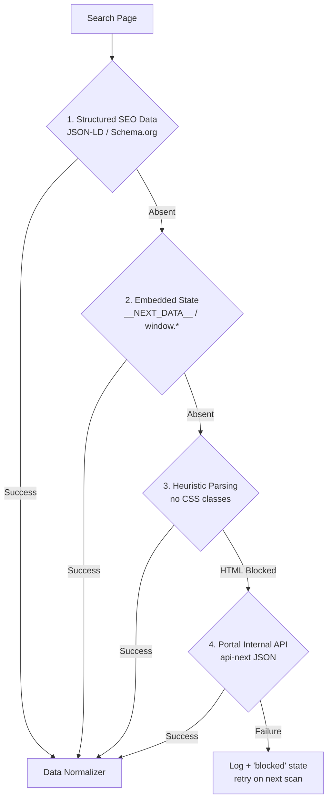
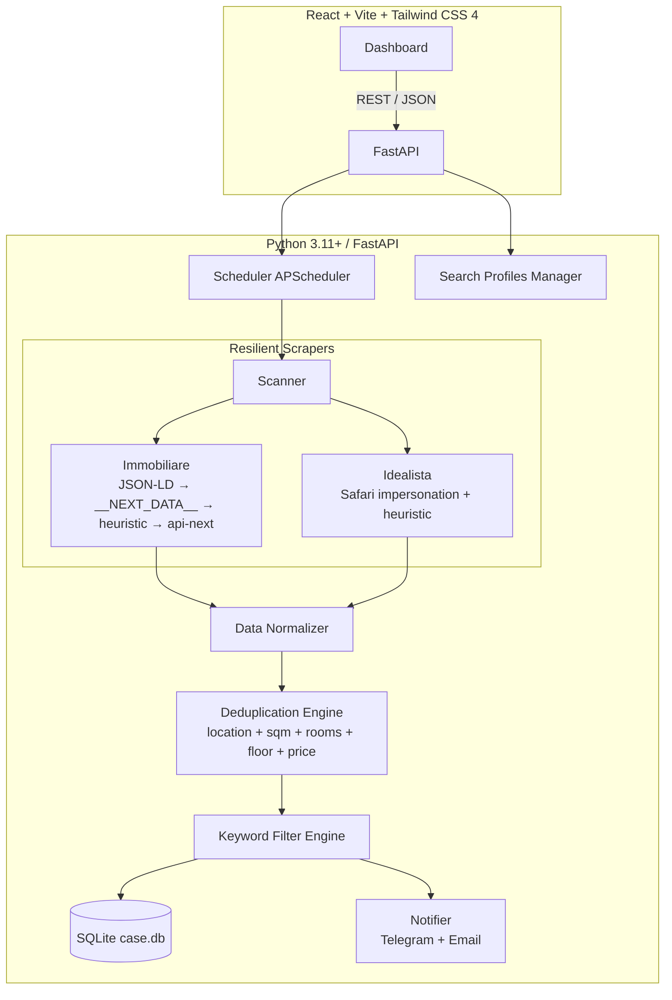

# Implementation Plan: Real Estate Search Platform (Immobiliare.it + Idealista)

This document describes the architecture and implementation status of a **unified local real estate search platform for Windows PC**. The system aggregates listings from **Immobiliare.it** and **Idealista**, merges cards belonging to the same physical property, filters listing texts (e.g., excluding "bare ownership" or "ground floor"), and sends notifications via **Telegram and/or Email**.

> **Status: implemented and tested against real portals** (July 2026).
> Section [§8](#8-deviations-from-original-plan) documents the initial assumptions of the original plan that **proved false on real portals** and how they were corrected. It is worth reading before modifying scrapers or the deduplication engine.

---

## 1. References (Projects to Draw Techniques From)

* **[flathunters/flathunter](https://github.com/flathunters/flathunter):** open-source multi-portal reference. *Adopted:* separation between scraping drivers, filtering engine, and notification dispatcher; the idea of **not notifying on the first scan** (otherwise hundreds of messages are sent at once).
* **[morrolinux/subito-it-searcher](https://github.com/morrolinux/subito-it-searcher):** leading Italian project for Subito.it. *Adopted:* the pattern of monitoring direct search URLs and Telegram message formatting.
* **[Stemanz/immobiscraper](https://github.com/Stemanz/immobiscraper):** scraper for Immobiliare.it. *Adopted:* reading embedded JSON payloads directly from the page instead of raw HTML.
* **[Vitor29Narciso/idealista-bot](https://github.com/Vitor29Narciso/idealista-bot):** bot for Idealista. *Adopted:* TLS impersonation and realistic delays between page requests.
* **[Apify Immobiliare.it Scraper](https://apify.com/):** paid cloud service. *Not implemented:* proved **unnecessary**, because the portal's internal API responds reliably from the local PC (see §3). It remains an option if that endpoint ever gets closed in the future.

---

## 2. Goals & Features

1. **Resilient Multi-Portal Scraping:** extraction from Immobiliare.it and Idealista using TLS impersonation (`curl_cffi`) to bypass DataDome protections.
2. **Deduplication Engine (Entity Resolution):** recognition of the same property published across multiple portals or by different agencies, merged under a single **Property** with price history and a list of sources (**Listing**).
3. **"Surgical" Text Filtering:** automatic exclusion of `bare ownership` (nuda proprietà), `ground floor` (piano terra), `basement` (seminterrato), `auction` (asta), along with price per sqm and price variation calculation against the first price observed.
4. **Search Mode — Direct Link:** paste the URL copied from Immobiliare.it or Idealista with zone and filters already configured on the portal.
   *v1 shipped with the direct URL alone, because it already covers every portal filter, including hand-drawn polygons on the map. A guided form was added later, plus an offline natural-language assistant that fills it in; both only generate a URL the user can still open and verify on the portal — the pasted URL remains the authoritative input.*
5. **Notifications & Automation:** background scheduler (30 min / 1h / 2h / 4h / 8h) or immediate manual scan; Telegram and/or Email notifications for new properties, price variations, and scraper outages.
6. **Web Interface:** single-page dashboard on `http://localhost:5173`, connected to the backend on `http://localhost:8000`.

---

## 3. Resilience: Surviving HTML Changes

Traditional scrapers break as soon as the website changes its CSS classes (`in-card__title` → `nd-property-title_xyz`). The system therefore uses a **cascaded strategy pipeline**: the first strategy that produces results wins, while the others serve as a safety net.



### 🔹 Strategy 1 — Structured SEO Data (`JSON-LD`)
Portals include a `<script type="application/ld+json">` block for Google indexing. When present, it is the most stable source.
**Measured Reality:** *neither portal exposes it on search pages.* Idealista has **zero**; Immobiliare pages are not even reachable via raw HTML (see §8.1). The strategy remains implemented because it is zero cost and would be the best if it reappeared.

### 🔹 Strategy 2 — Framework Embedded State (`__NEXT_DATA__`)
Immobiliare.it is built on Next.js and embeds page state in a JSON object. The parser searches it **recursively**, without relying on the exact key path (which changes between site versions).

### 🔹 Strategy 3 — Heuristic Parsing (Zero CSS Classes)
It **never** searches for CSS classes. It only uses patterns the portal cannot change without breaking its own functionality:
- listings are links containing `/annunci/<id>` or `/immobile/<id>`;
- price is a number next to `€`, between 10,000 and 20,000,000;
- rooms and square meters via regex (`(\d+)\s*local[ei]`, `(\d+)\s*m[q²]`).

**Card boundary:** text is read upwards from the ad link up to the **last ancestor containing only one ad**. Without this boundary, the parser would climb up to the document `<footer>` and read footer numbers as prices and square footage (see §8.3). This strategy — not #1 or #2 — is what makes Idealista work today.

### 🔹 Strategy 4 — Portal Internal API (`api-next`)
When DataDome blocks HTML, Immobiliare.it still responds on its internal JSON endpoint:
`https://www.immobiliare.it/api-next/search-list/listings/`
Requires resolved geographical parameters (`idComune`, `idMZona[]`, `fkRegione`, `idProvincia`), obtained from the `api-next/geography/autocomplete/` endpoint starting from the location name found in the user-pasted URL. User filters (`prezzoMassimo`, `superficieMinima`, etc.) already use the names expected by the API and are passed through unchanged.

> ⚠️ **Warning:** passing only `path` without geographical parameters returns `200 OK` with **all 500,000 ads across Italy** instead of those in the city. A silent failure rather than an error: this is why geographical resolution is mandatory.

---

## 4. Architecture



### TLS Impersonation
DataDome inspects the TLS handshake, not just the `User-Agent`. **Measured on both portals:** Chrome desktop and Firefox profiles receive `403`; only **Safari** (`safari184`) passes cleanly. Impersonations are therefore an **ordered preference list**, and upon blocking, the scraper rotates to the next one — not a random choice.

---

## 5. Project Structure

```
progetto/
├── backend/
│   ├── app/
│   │   ├── main.py               # FastAPI: REST routes + static frontend mount
│   │   ├── config.py             # settings.json (Telegram/SMTP, keywords, intervals)
│   │   ├── database.py           # SQLAlchemy + SQLite (case.db), additive migrations + Alembic
│   │   ├── models.py             # Property, Listing, PriceHistory, SearchProfile, ImportedListing, PricingSnapshot
│   │   ├── schemas.py            # Pydantic v2
│   │   ├── scrapers/
│   │   │   ├── base.py           # BaseScraper, TLS rotation, price/sqm parser, card boundary
│   │   │   ├── immobiliare.py    # 4 strategies, including internal API
│   │   │   └── idealista.py      # Safari impersonation + heuristic parsing
│   │   └── services/
│   │       ├── deduplicator.py   # entity resolution + price history
│   │       ├── filter_engine.py  # word-boundary keyword filtering
│   │       ├── scanner.py        # orchestration + notifications + scraper health
│   │       ├── scheduler.py      # APScheduler + catch-up scan on startup
│   │       ├── backup.py         # automatic case.db copies with rotation
│   │       ├── notifier.py       # Telegram Bot API + SMTP email
│   │       ├── pricing_stats.py  # €/sqm medians, market position per property
│   │       ├── market_velocity.py# days-on-market and agency statistics
│   │       ├── query_parser.py   # offline natural-language search assistant
│   │       ├── search_builder.py # structured params -> portal search URLs
│   │       ├── email_import.py   # read-only IMAP inbox import, staged for review
│   │       ├── availability_check.py # on-demand "is it still online?" batch for dashboard properties
│   │       ├── repair_listings.py # local data repair (titles, images) + live enrichment
│   │       ├── data_reset.py      # scoped irreversible data wipes (Settings -> Data management)
│   │       └── cookie_harvester.py # optional Playwright DataDome cookie grab
│   ├── alembic/                  # migration harness (baseline + future non-additive changes)
│   ├── alembic.ini
│   ├── tests/                    # 321 tests
│   ├── requirements.txt
│   └── run.py
├── frontend/                     # React + Vite + Tailwind CSS 4
│   └── src/
│       ├── App.tsx
│       ├── components/           # Navbar, SearchProfiles, FiltersBar, PortalBadge,
│       │                         # PropertyCard, PropertyModal, SettingsModal,
│       │                         # MapView, MarketVelocity, Calculators, EmailImport,
│       │                         # ErrorBoundary
│       ├── services/api.ts
│       └── types/index.ts
├── start.bat                     # double click: backend + frontend + browser
├── serve.bat                     # single port 8000: built dashboard + API, for phones
└── README.md
```

---

## 6. Deduplication Engine — Effective Rules

> **Guiding principle: showing the same house twice is far better than merging two different houses.** A false merge *hides* a property from the user and pollutes the price history; a missed merge only costs one extra card.

Two listings are merged only if **all** of these conditions hold true:

| Condition | Threshold | Notes |
|---|---|---|
| Surface (sqm) | ±5% | mandatory on both sides |
| Rooms | identical | when known on both sides |
| Floor | identical | when known on both sides |
| Price | ±5% | **mandatory on both sides**, compared against every already-merged listing |
| **Proof of location** | coordinates ≤ 60 m **OR** same street **AND** house number | at least one of the two required |

---

## 7. Verification Plan

### Automated Tests (290, `pytest`)
```bash
cd backend
.venv\Scripts\python -m pytest tests
```
Cover: parsing strategies (JSON-LD, `__NEXT_DATA__`, heuristics, API parameter building), card boundaries, price parsers across both portal formats, the deduplication engine (correct merges **and** false merges encountered with real data), keyword filtering, first-scan notification suppression, scraper health alerting, pricing and market-velocity statistics, the natural-language query parser and search-URL builder, the read-only IMAP inbox import (against a fake IMAP client), the startup catch-up-scan decision, and the automatic DB backup (freshness gate, rotation, fail-safety).

### Manual Verification
1. Double click `start.bat`.
2. On `http://localhost:5173`, paste one search URL from Immobiliare.it and one from Idealista.
3. Click **"▶ Start Scan Now"**: the grid populates with unified property cards.
4. ⚙️ Settings → bot token and Chat ID → **"Send test message"**.

### Testing Performed on Real Portals (Milan, July 2026)
- **275 listings** collected (125 Immobiliare via `api-next`, 150 Idealista via heuristics) → **261 properties** after deduplication.
- 0 listings without price, 0 contamination from footer text.
- Merges: 13, including 1 cross-portal merge verified manually (same address, same price, same rooms and sqm on both portals).
- Keyword filter: 26 properties discarded (`ground floor`, `basement`, `bare ownership`), no false positives.

---

## 8. Deviations from Original Plan

These assumptions from the original plan were **disproven by real-world data**. They are documented here because reintroducing any of them breaks the system silently.

### 8.1 "JSON-LD is immortal, guarantees 99% stability" — **False**
HTML search pages on **Immobiliare.it are blocked by DataDome with `403` across every TLS impersonation**: there is no JSON-LD to read because the HTML page is never received. **Idealista** returns the page but contains **zero** JSON-LD blocks.
→ Immobiliare works thanks to **Strategy 4** (internal API), and Idealista works thanks to **Strategy 3** (heuristic parsing). Strategies 1 and 2 remain as zero-cost safety nets.

### 8.2 Deduplication thresholds ±10% sqm / ±6% price on `city + rooms` — **Too permissive**
With real data, this rule merged **7 different apartments** into a single card, with prices ranging from €416,000 to €499,000: in Milan, hundreds of three-room apartments around ~100 sqm cost ~€450,000. Worse, merges **chained transitively** (A≈B, B≈C ⇒ A,B,C merged), and comparing against only the *minimum* price made the threshold slip downward with every merge.
→ Now **location proof** (coordinates or street+house number) is mandatory, and thresholds are ±5%; price is mandatory and checked against **every** listing already merged.

### 8.3 Card parsing "climbing up 6 parent levels until finding a price" — **Fragile**
When a card did not expose a recognizable price, the parser climbed up to the document root and read the **footer**: 107 out of 120 ads ended up without a price and **all** of them with `40 sqm` (a number taken from the page footer). The correct card boundary is the last ancestor containing **only one** listing.

### 8.4 Price written as `€ 250.000` — **Only on one portal**
Idealista writes `399.000 €` (symbol **after** the number) and in the same card displays two decoys: `3.990 €/m²` (price per square meter) and `Box opz. 39.000 €` (optional garage). The parser now recognizes both symbol orders, discards price per sqm, and picks the first plausible amount in reading order.

### 8.5 Keywords searched as substrings — **False positives**
`asta` (auction) discarded **166 valid properties** because it appears inside `Castanese` (a neighborhood in Milan) and `vasta metratura` (large square footage). Matching now requires **word boundaries**.
Furthermore, Immobiliare exposes the floor in structured form (`"T"` = ground, `"S"` = basement): this is translated into text, otherwise ground floor units would slip past the keyword filter.

### 8.6 "Notify on every new property" — **Must be moderated**
During the first scan of a search profile, *every* property is new: hundreds of Telegram notifications would be fired within seconds. The first pass now **only builds the comparison baseline** without notifying, and every subsequent scan sends at most 15 messages plus a summary.

### 8.7 Apify cloud fallback — **Unnecessary**
Planned as a Plan B in case of IP blocks. Immobiliare's internal API responds reliably from the local PC, so cloud fallback was not implemented. It remains the natural fallback if that internal endpoint ever closes.

### 8.8 "In an alert email, every `/annunci/<id>` link is a listing" — **False**
The same email links an ad from its photo, from a call-to-action button, and once more from the *"se il link non funziona, copia questo indirizzo"* footer, whose anchor text is the bare URL. Templates also ship placeholder `/annunci/0/` links. Those footer links produced review rows titled `https://www.immobiliare.it/annunci/128621066/` and priced `N/A` — nothing to judge them by, and the ad behind one had already been taken down. A link is now staged only if the email said *something* about it (name, price, surface or rooms); anchor text that is a URL or a CTA phrase is not a title.

### 8.9 "`last_run_at is None` means first scan" — **False**
§8.6's silent-first-scan fix used `profile.last_run_at is None` as the "is this the first scan" test. But `last_run_at` is stamped on *any* scan attempt, including one that gets blocked or errored before fetching a single listing — needed so the scheduler knows the profile was attempted. A profile blocked on its very first try then "used up" its silent baseline: the next attempt, the first to actually see real listings, treated all of them as newly discovered and fired a notification for each. Fixed with a dedicated `SearchProfile.baseline_done` flag, set only once listings have actually been processed into a baseline — independent of how many attempts it took to get there.

---

## 9. Known Limitations

- **Conservative cross-portal merging.** Idealista does not publish coordinates on search pages, and Immobiliare exposes house numbers only in roughly one third of listings: when both location proofs are missing, two listings remain separate cards. This is a deliberate precision trade-off (§6). To increase coverage, fetching the individual detail page of every Idealista ad would be needed (many more requests, higher blocking risk).
- **Idealista may block temporarily.** The profile status will show `Blocked (will retry)`; the scan of other profiles continues, and it retries on the next round.
- **Internal endpoints are not contractual.** `api-next` can change without notice: if it happens, strategies 1–3 remain active and the profile reports an error instead of saving wrong data.
- The "📉 price drop" badge compares current minimum price against the first price observed: for a property listed on two portals at different prices, it also indicates "costs less elsewhere", not just a price drop over time.

---

## 10. July 2026 Post-Testing Review

Field testing also produced the property-lifecycle rules (`gone`, `hidden`), the
minimum-price semantics of `price_changed`, and additive profile keywords. Those
are live invariants, not history: they are stated once in project developer instructions and are not
repeated here. Two findings have no other home:

- **Multi-word Idealista city.** `sesto-san-giovanni-milano` became "Sesto" (breaking cross-portal dedup); the segment is `municipality-province` and the province is discarded. Polygon searches (`/aree/…`) have no city.
- **Rotating log file** (`backend/app.log`): the scheduler runs at night; without a log file, failed scans could not be diagnosed.
